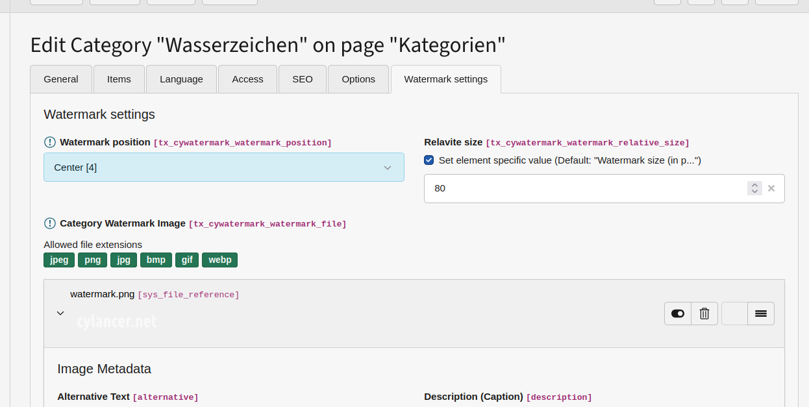

# TYPO3 extension cyWatermark

## Change log

* 0.4.1 FIX Fix an option text.
* 0.4.0 UPD Connect the extension settings to the watermark service.
* 0.3.0 DOC Add a readme documentation.
* 0.2.0 INI beta version
* 0.1.0 INI version
* 0.0.1 INI initial

## Watermarks for Frontend Images

This extension allows you to apply watermarks to images in Typo3.

### Features

* Watermarks can be assigned individually per image or by category.
* Watermarks can be placed in various positions on the image:
  * Top right
  * Bottom left
  * Top right
  * Center horizontally
  * Center diagonally
* Watermark size can be specified relative to the image.
* Watermarks do not modify the original image.
* Cropped image previews can be used.

### Installation

This extension allows you to apply watermarks to images in TYPO3.

### Administration


* **In JSON format, you can specify the PHP-supported memory options for each image format here.**
  \
  Here are the default values in a pretty format:

  ```JSON
    {
    "jpeg":{
        "quality":75
    },
    "webp":{
        "quality":80
    },
    "bmp":{
        "compressed":true
    },
    "png":{
        "quality":-1,
        "filters":"NO_FILTER"
    }
    }
  ```

  *Hint:* Thif gif-format has not save options. (see:  [PHP: imagegif - Manual](https://www.php.net/manual/en/function.imagegif.php))

* **Supported mime types (comma separated)**
   \
   Here are the default values in a pretty format:

   ```Code
   image/jpeg,image/png,image/gif,image/webp,image/bmp
   ```

### Usage

1. **Preparation**
   1.1 Create a watermark. Here’s an example with a transparent background and semi-transparent text:
       
   1.2 Upload it into Typo3
       

2. **Individual Image Settings**
   2.1 You can configure the watermark source directly on the image:
       

3. **Watermark Definition via Category (default)**
   3.1 Create a watermark category
       
       and select your watermark file here:
       
   3.2 Image setting – Source set to chosen categories
       When you select this source, all categories assigned to the image are scanned for watermark settings and applied.
       
       Note: If watermark source is set to “Category” or “No watermark,” the following settings apply:
       - Watermark position
       - Relative size
       - Watermark file
   3.3 Choose the category
       

4. **Result**
    

## Troubleshooting

Watermarks are only stamped in on first display. If you change watermark settings on images that have already been displayed, the updates won’t appear immediately. The most radical and effective solution is to delete the _processed_ files:


